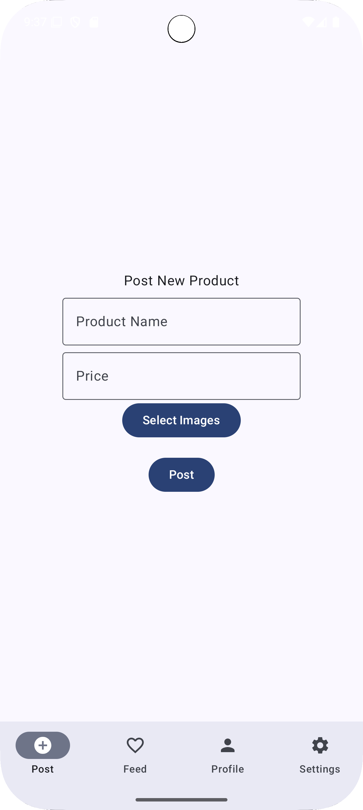
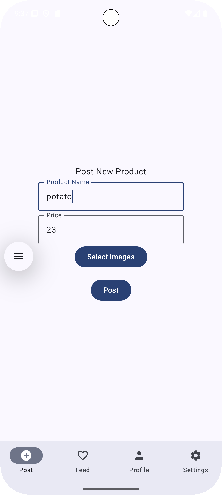
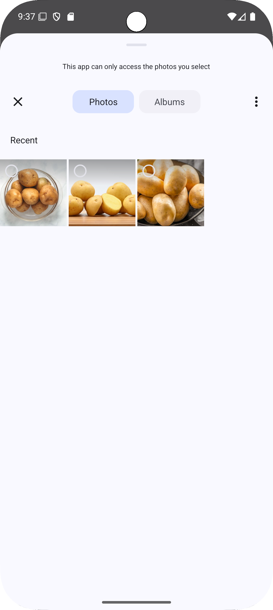
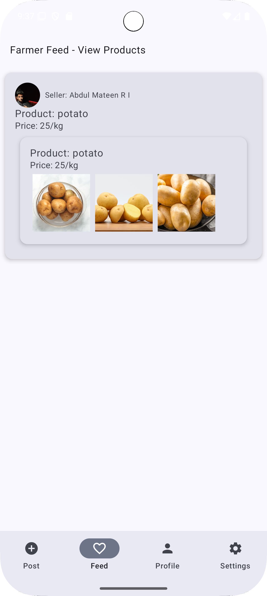
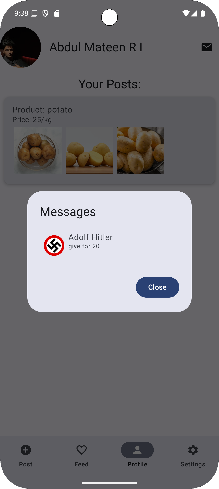
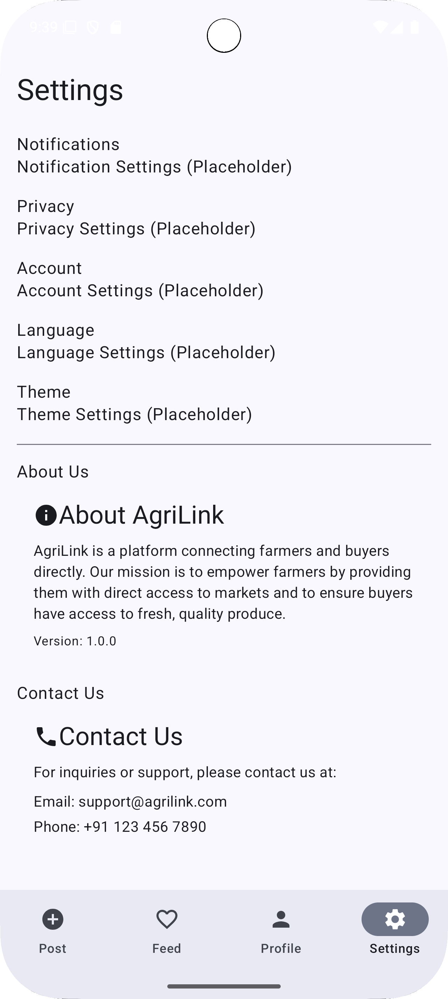

# AgriLink – Direct Market Access for Farmers

AgriLink is a Kotlin-based Android application designed to empower farmers by connecting them directly to consumers and retailers, cutting out intermediaries and ensuring better prices for their produce.

---

## 🚜 Features

- 👨‍🌾 **Farmer & Buyer Profiles**
- 📦 **Product Listing by Farmers**
- 💬 **Realtime Chat** between farmers and buyers
- 📍 **Send Current Location** without requiring Google Maps API
- 🖼️ **Product Images with Glide**
- 🔐 **Firebase Authentication**
- ☁️ **Firebase Firestore** for item data
- 🔄 **Realtime Database** for chat

---

## 📸 Screenshots

<div align="center">
  
  
  
  
  
  
  
  
</div>

---

## 🛠️ Built With

- Kotlin + Jetpack Compose
- Firebase (Authentication, Firestore, Realtime Database)
- Fused Location Provider (for sending location)
- Glide (for image loading)

---

## 📦 Setup Instructions

1. Clone the repo:
   ```bash
   git clone https://github.com/mat-in/AgriLink_Direct_Market_Access_for_farmers.git
